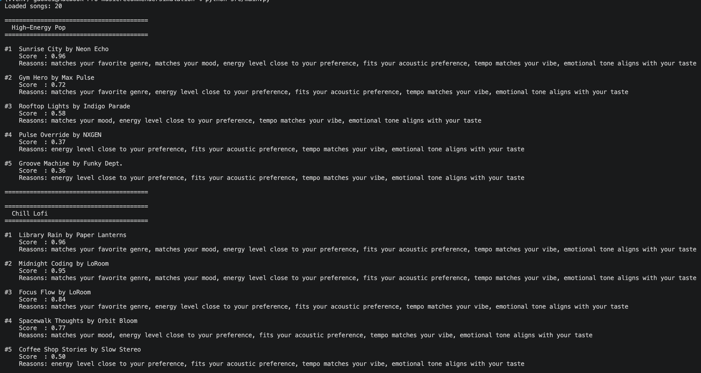
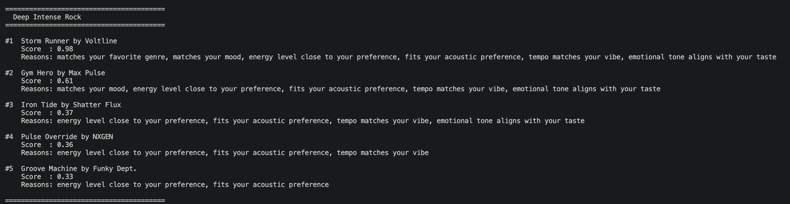

# 🎵 Music Recommender Simulation

## Project Summary

In this project you will build and explain a small music recommender system.

Your goal is to:

- Represent songs and a user "taste profile" as data
- Design a scoring rule that turns that data into recommendations
- Evaluate what your system gets right and wrong
- Reflect on how this mirrors real world AI recommenders

Replace this paragraph with your own summary of what your version does.

---

## How The System Works

Real-world recommenders like Spotify watch what you and millions of other people listen to, skip, and save. They find users who behave like you and suggest what those users enjoyed next. Our version skips the crowd entirely. It looks only at the song itself — its mood, energy, tempo, and sound texture — and compares those qualities directly to what the user says they want right now. The closer a song is to the user's preference, the higher it scores. The top-scoring songs are recommended.

- **Song features:** each song stores `genre`, `mood`, `energy`, `tempo_bpm`, `acousticness`, and `valence` — qualities that describe how a song sounds and feels
- **UserProfile stores:** the user's `favorite_genre`, `favorite_mood`, `target_energy` (how intense they want the music), and `likes_acoustic` (whether they prefer acoustic or electronic sound)
- **Scoring:** the system compares each song's features to the user's preferences and gives a score from 0 to 1 — higher means a closer match
- **Ranking:** every song in the catalog gets a score, they are sorted from highest to lowest, and the top K results are returned as recommendations

---

### Algorithm Recipe

**Step 1 — Score Each Song (0.0 to 1.0)**

Every song gets a total score built from six weighted components:

```
total_score = (genre_score    × 0.35)
            + (mood_score     × 0.25)
            + (energy_score   × 0.20)
            + (acoustic_score × 0.10)
            + (tempo_score    × 0.05)
            + (valence_score  × 0.05)
```

**Step 2 — Compute Each Component**

**Genre Score (35%)** — does the song's genre match the user?
```
exact match   → 1.0   (song.genre == user.favorite_genre)
related match → 0.5   (e.g. pop ↔ indie-pop, lofi ↔ chillhop)
no match      → 0.0
```

**Mood Score (25%)** — does the song's mood match the user?
```
exact match    → 1.0   (song.mood == user.favorite_mood)
neighbor match → 0.5   (chill ↔ relaxed ↔ focused)
no match       → 0.0
```

**Energy Score (20%)** — how close is the song's energy to the target?
```
energy_score = 1.0 - abs(song.energy - user.target_energy)
```

**Acoustic Score (10%)** — does the song match the user's texture preference?
```
if user.likes_acoustic:
    acoustic_score = song.acousticness
else:
    acoustic_score = 1.0 - song.acousticness
```

**Tempo Score (5%)** — is the tempo in the right range?
```
song_tempo_norm   = (song.tempo_bpm - 60) / 108
target_tempo_norm = (target_bpm - 60) / 108    # derived from target_energy
tempo_score = 1.0 - abs(song_tempo_norm - target_tempo_norm)
```

**Valence Score (5%)** — does the emotional tone match?
```
mood_to_valence = { "focused": 0.60, "chill": 0.58, "relaxed": 0.70, ... }
valence_score = 1.0 - abs(song.valence - mood_to_valence[user.favorite_mood])
```

**Step 3 — Rank All Songs**
```
scored_songs = [(song, total_score) for every song in catalog]
ranked       = sort by total_score, highest first
recommendations = take top k results
```

**Step 4 — Explain Each Recommendation**

Any component that scored above its threshold contributes a reason:
```
genre    ≥ 0.7  →  "matches your favorite genre"
mood     ≥ 0.7  →  "matches your mood"
energy   ≥ 0.7  →  "energy level close to your preference"
acoustic ≥ 0.7  →  "fits your acoustic preference"
tempo    ≥ 0.6  →  "tempo matches your vibe"
valence  ≥ 0.6  →  "emotional tone aligns with your taste"
```

---

### Expected Biases

- **Genre gets too much power:** A song that fits the user's mood and energy perfectly can still rank low just because the genre is different.
- **Missing genre and mood hurts too much:** If a song misses both, it loses 60% of its score right away and good songs in other genres rarely make it to the top.
- **Acoustic is all or nothing:** A user who likes both acoustic and electric music will still be pushed toward one side based on a single yes/no setting.

---

## Terminal Output






---

## Getting Started

### Setup

1. Create a virtual environment (optional but recommended):

   ```bash
   python -m venv .venv
   source .venv/bin/activate      # Mac or Linux
   .venv\Scripts\activate         # Windows

2. Install dependencies

```bash
pip install -r requirements.txt
```

3. Run the app:

```bash
python src/main.py
```

### Running Tests

Run the starter tests with:

```bash
pytest
```

You can add more tests in `tests/test_recommender.py`.

---

## Experiments You Tried

Use this section to document the experiments you ran. For example:

- What happened when you changed the weight on genre from 2.0 to 0.5
- What happened when you added tempo or valence to the score
- How did your system behave for different types of users

---

## Limitations and Risks

Summarize some limitations of your recommender.

Examples:

- It only works on a tiny catalog
- It does not understand lyrics or language
- It might over favor one genre or mood

You will go deeper on this in your model card.

---

## Reflection

[**Model Card**](model_card.md)

